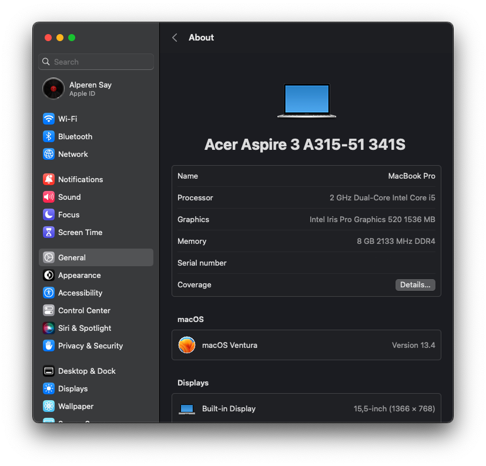
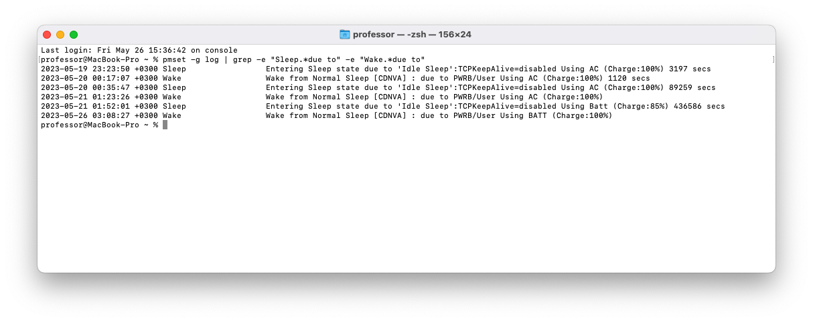

# Acer-Aspire-3-A315-51 341S OC for MacOS Ventura
OpenCore EFI for fully working MacOS Ventura on Acer Aspire 3 A315-51 341S.

This project was meticulously built from the ground up, utilizing invaluable resources such as the [Opencore - Dortania Guide](https://dortania.github.io/OpenCore-Install-Guide/) & [OC-Little - 5t33z0](https://5t33z0.gitbook.io/oc-litte-translated/). I extend my deepest gratitude to the remarkable community that has created these comprehensive guides. Since the initial installation, I have seamlessly executed two MacOS updates, underscoring the effectiveness and reliability of the setup.

## System Information

| Specifications      | Details                                     |
| ------------------- | ------------------------------------------- |
| Computer model      | Acer Aspire 3 A315-51 341S                  |
| Processor           | Intel Core i3-6006U @2.0GHz 2C4T            |
| Memory              | 8GB DDR4 Dual Channel @2133GHz              |
| SSD                 | 128GB M.2 SATA                              |
| Integrated Graphics | Intel HD Graphics 520                       |
| Monitor             | HD 1366x768@60Hz (15.6 inch)                |
| Sound Card          | Realtek ALC255                              |
| Wireless Card       | BCM94360CS2 (swapped)                       |
| Ethernet Card       | Realtek RTL8111                             |
| Card Reader         | Realtek RTL8411B                            |
| Touchpad            | I2C HID Synaptics SYNA7DB1                  |
| Keyboard            | PS2                                         |
| Bootloader          | OpenCore 0.9.1 RELEASE                      |
| SMBIOS              | MacBookPro14,1                              |

## DSDT-SSDT
- The process of crafting bespoke SSDT files for this particular model required a multi-step approach. Initially, I extracted the DSDT from Windows 10. Thereafter, modifications were made to ensure its compatibility with MacOS, with particular attention paid to TPXX. A substantial amount of research was invested in DSDT - SSDT to guarantee its successful implementation and functionality.

## Working
- [x] Intel HD 520 Full QE/CI 
- [x] Smooth Screen Brightness Control 
- [x] Display at native resolution and at 60hz
- [x] HDMI Port + HDMI Audio out
- [x] Efficient Power management (idle @500-800MHz)
- [x] Sleep & Wake (no darkwake)
- [x] I2C Trackpad featuring all gestures (#gpi0 pinned to operate in interrupt mode)
- [x] All USB ports & USB 3.0
- [x] Web Camera
- [x] Wifi
- [x] Bluetooth
- [x] Battery Percentage
- [x] All Fn keys including multimedia
- [x] Speakers
- [x] Headphone jack (Headphone only. Did not bother for headset since I don't use it)
- [x] Internal microphone
- [x] Airdrop & Handoff
- [x] FaceTime & iMessage

## BIOS Settings
    Press the power button to turn on your device.
    Immediately hold down the 'Fn' and 'Tab' keys simultaneously for approximately 3 seconds.
    Release these keys and promptly press 'F2'.

Upon gaining access, make sure to modify the following settings:

    Set 'CFG Lock' to 'Off'.
    Change the 'Touchpad' setting to 'Advanced'.

## Sleep

## Note
  Generate your own SMBIOS before using it.

## Credits
- [acidanthera](https://github.com/acidanthera) for providing
        [AppleALC](https://github.com/acidanthera/AppleALC), 
        [CPUFriend](https://github.com/acidanthera/CPUFriend),
        [Lilu](https://github.com/acidanthera/Lilu), 
        [OpenCorePkg](https://github.com/acidanthera/OpenCorePkg), 
        [VirtualSMC](https://github.com/acidanthera/VirtualSMC), 
        [VoodooPS2](https://github.com/acidanthera/VoodooPS2),
        [WhateverGreen](https://github.com/acidanthera/WhateverGreen).
- [daliansky](https://github.com/daliansky) for providing 
        [OC-little](https://github.com/daliansky/OC-little).
- [5t33z0](https://github.com/5T33Z0) for providing
        [OC-Little Translated: ACPI Hotpatch Samples and Guides for OpenCore](https://github.com/5T33Z0/OC-Little-Translated).
- [alexandred](https://github.com/alexandred) for providing 
        [VoodooI2C](https://github.com/alexandred/VoodooI2C).
- [corpnewt](https://github.com/corpnewt) for providing
        [CPUFriendFriend](https://github.com/corpnewt/CPUFriendFriend).
- [dhinakg](https://github.com/dhinakg) for providing
        [USBToolBox](https://github.com/USBToolBox/kext).
- [cholonam](https://github.com/cholonam) for providing
        [Sinetek-rtsx](https://github.com/cholonam/Sinetek-rtsx).

